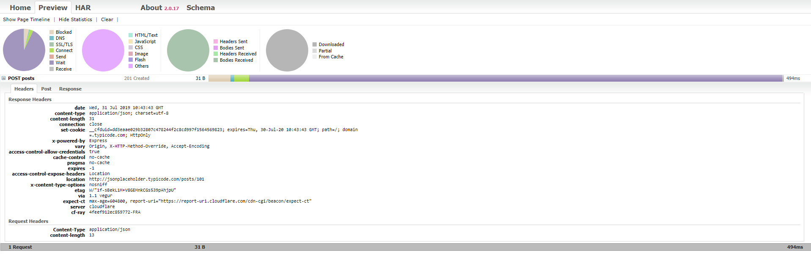
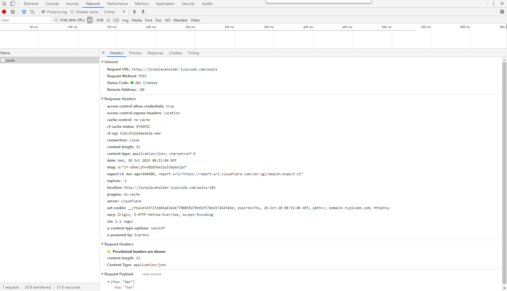

This library was designed for gathering HAR files from requests sent using `request` and `request-promise`

## Credits
Inspiration and some pieces of the code comes from long forgotten repo
https://github.com/paulirish/request-capture-har

It has been rewriten to TypeScript and extended.

## Usage
In order to use this package import it and then pass either `request` or `request-promise` package into the constructor, which means that it will work for both sync and async calls.

In order to perform an actual request simply use the `request()` method and pass the request options.

Every single request is pushed into the array and can be dumped into a file in any time using `save()` method.

In order to clear an array use `clear()` method.

## Example

```nodejs
const RequestHar = require('request-har').RequestHar
const har = new RequestHar(require('request-promise').defaults({resolveWithFullResponse: true}))

let requestOptions = {
  url: 'https://jsonplaceholder.typicode.com/posts',
  method: 'POST',
  headers: {
    'Content-Type': 'application/json'
  },
  body: JSON.stringify({
    foo: 'bar'
  })
}

let response = await har.request(requestOptions)

har.saveFile('./json-placeholder.har')
```

Result file can be used to visualize requests using [Har viewer](http://www.softwareishard.com/har/viewer/)



It can be also visualised by simply drag and dropping file onto Chrome network tab.



Saving this will output as following json file which can be used to visualise

```json
{
  "log": {
    "version": "1.2",
    "creator": {
      "name": "request-har",
      "version": "1.0.0"
    },
    "pages": [],
    "entries": [
      {
        "startedDateTime": "2019-07-31T10:43:42.981Z",
        "time": 494,
        "request": {
          "method": "POST",
          "url": "https://jsonplaceholder.typicode.com/posts",
          "httpVersion": "HTTP/1.1",
          "headers": [
            {
              "name": "Content-Type",
              "value": "application/json"
            },
            {
              "name": "content-length",
              "value": "13"
            }
          ],
          "queryString": [],
          "cookies": [],
          "headersSize": -1,
          "bodySize": -1,
          "postData": {
            "mimeType": "application/json",
            "text": "{\"foo\":\"bar\"}"
          }
        },
        "response": {
          "status": 201,
          "statusText": "Created",
          "httpVersion": "HTTP/1.1",
          "headers": [
            {
              "name": "date",
              "value": "Wed, 31 Jul 2019 10:43:43 GMT"
            },
            {
              "name": "content-type",
              "value": "application/json; charset=utf-8"
            },
            {
              "name": "content-length",
              "value": "31"
            },
            {
              "name": "connection",
              "value": "close"
            },
            {
              "name": "set-cookie",
              "value": "__cfduid=dd3eaae029b32807c478244f2c8cd997f1564569823; expires=Thu, 30-Jul-20 10:43:43 GMT; path=/; domain=.typicode.com; HttpOnly"
            },
            {
              "name": "x-powered-by",
              "value": "Express"
            },
            {
              "name": "vary",
              "value": "Origin, X-HTTP-Method-Override, Accept-Encoding"
            },
            {
              "name": "access-control-allow-credentials",
              "value": "true"
            },
            {
              "name": "cache-control",
              "value": "no-cache"
            },
            {
              "name": "pragma",
              "value": "no-cache"
            },
            {
              "name": "expires",
              "value": "-1"
            },
            {
              "name": "access-control-expose-headers",
              "value": "Location"
            },
            {
              "name": "location",
              "value": "http://jsonplaceholder.typicode.com/posts/101"
            },
            {
              "name": "x-content-type-options",
              "value": "nosniff"
            },
            {
              "name": "etag",
              "value": "W/\"1f-sBekL1M+V8GEMnkCGs539pAhjpU\""
            },
            {
              "name": "via",
              "value": "1.1 vegur"
            },
            {
              "name": "expect-ct",
              "value": "max-age=604800, report-uri=\"https://report-uri.cloudflare.com/cdn-cgi/beacon/expect-ct\""
            },
            {
              "name": "server",
              "value": "cloudflare"
            },
            {
              "name": "cf-ray",
              "value": "4feef912ec859772-FRA"
            }
          ],
          "cookies": [],
          "content": {
            "size": 31,
            "mimeType": "application/json; charset=utf-8",
            "text": "{\n  \"foo\": \"bar\",\n  \"id\": 101\n}"
          },
          "redirectURL": "",
          "headersSize": -1,
          "bodySize": 31
        },
        "cache": {},
        "timings": {
          "blocked": 18.857,
          "dns": 3.105,
          "connect": 12.983,
          "send": 0,
          "wait": 457.125,
          "receive": 1.506
        }
      }
    ]
  }
}
```
